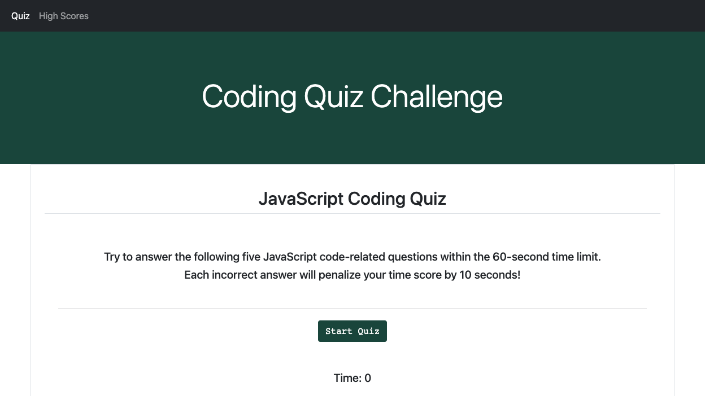
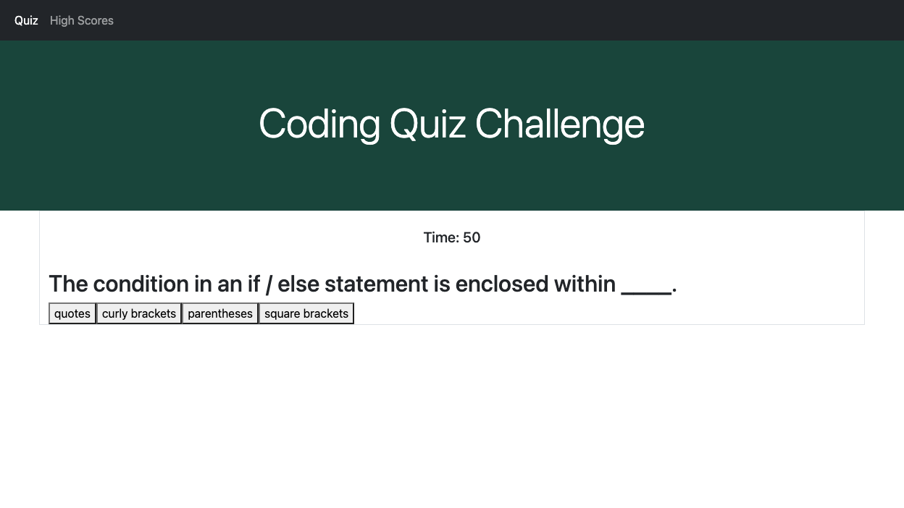

# 04_Code-Quiz
## Description

For this project, the goal was to build a JavaScript coding assessment application to test the knowledge of coding boot camp students in preparation for future developer interviews. For the quiz, users are given 60 seconds to answer five multiple-choice questions. For each wrong answer, ten seconds is subtracted from the time. Once the assessment is completed or time runs out, the remaining time represents the user's score. This project was an opportunity for our class to use HTML, CSS, and JavaScript to build a dynamic, interactive web page.

## Table of Contents

- [User Story](#user-story)
- [Acceptance Criteria](#acceptance-criteria)
- [Screenshots](#screenshots)
- [Deployed Application Link](#deployed-application-link)
- [Credits](#credits)
- [License](#license)

# User Story

```
AS A coding boot camp student
I WANT to take a timed quiz on JavaScript fundamentals that stores high scores
SO THAT I can gauge my progress compared to my peers
```

## Acceptance Criteria

```
GIVEN I am taking a code quiz
WHEN I click the start button
THEN a timer starts and I am presented with a question
WHEN I answer a question
THEN I am presented with another question
WHEN I answer a question incorrectly
THEN time is subtracted from the clock
WHEN all questions are answered or the timer reaches 0
THEN the game is over
WHEN the game is over
THEN I can save my initials and my score
```

## Screenshots
These are screenshots that demonstrate the application in action:

1. The user clicks "Generate Password" and specifies a password length between 8 and 128 characters.


2. Once the Start Quiz button is clicked, the coding quiz begins and the questions are displayed.


## Deployed Application Link

This is a link to the deployed application: https://jamesljenks.github.io/04_Code-Quiz/  
## Credits
- Trilogy Education Services, LLC
- Bootstrap: https://getbootstrap.com/ 
- W3 Schools: https://www.w3schools.com/
- MDN Web Docs: https://developer.mozilla.org/en-US

## License

This project was created by James L. Jenks as part of the curriculum for the MSU Coding Boot Camp and Trilogy Education Services.

© 2021 Trilogy Education Services, LLC, a 2U, Inc. brand. Confidential and Proprietary. All Rights Reserved.
    